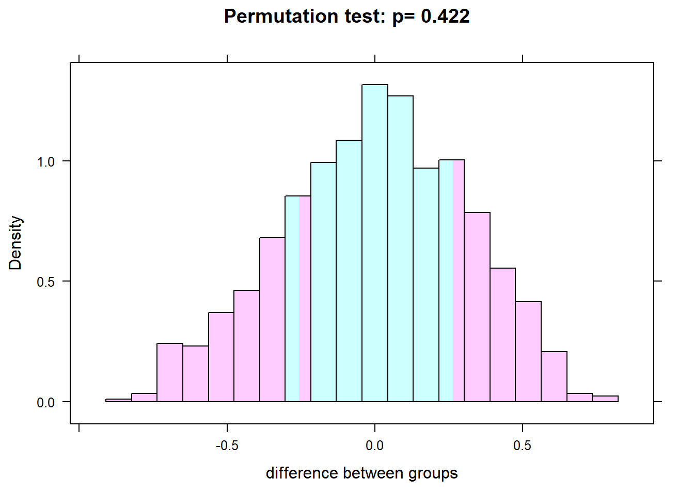

# Randomization

Here is a review of existing methods.

## Understanding the basics

Let us write a very simple data-generating process (DGP) for a trivial RCT.


```r
library(mvtnorm)
set.seed(2001)
beta <- 0.5
sigma <- matrix(c(1.0,0.0,
                  0.0,1.0),ncol=2)

## Generate residuals and variables
N <- 20
m <- rmvnorm(N,mean=c(0,0),sigma=sigma)

## Write down the DGP:
Dstar <- m[,1]
D <- ifelse(Dstar>0,1,0)
Y <- beta*D + m[,2]
data <- data.frame(cbind(D,Y))
head(data)
```

```
##   D          Y
## 1 1 -0.2778131
## 2 0  0.3027668
## 3 1  1.3985959
## 4 1  1.1322528
## 5 1 -0.6073642
## 6 0  0.8978806
```

The standard way of doing the impact evaluation is then simply a comparison of means, which boils down to an OLS regression.


```r
summary(lm(Y ~ D))
```

```
## 
## Call:
## lm(formula = Y ~ D)
## 
## Residuals:
##     Min      1Q  Median      3Q     Max 
## -1.0354 -0.3314 -0.1213  0.2210  1.7923 
## 
## Coefficients:
##             Estimate Std. Error t value Pr(>|t|)
## (Intercept)   0.1647     0.2606   0.632    0.535
## D             0.2634     0.3233   0.815    0.426
## 
## Residual standard error: 0.6896 on 18 degrees of freedom
## Multiple R-squared:  0.03556,	Adjusted R-squared:  -0.01802 
## F-statistic: 0.6636 on 1 and 18 DF,  p-value: 0.4259
```

@Heckman96


## The randomista debate

@Deaton2010 
@Imbens10 
@Barrett2010 
@Ravallion2012 
@Deaton2016
@Ravallion2018

## Bias and randomization inference

@Young2016a

The basic idea behind randomization inference is to do all of the permutations of treatment status `D`.
We can do this with the `mosaic` package.


```r
# How many unique permutations are there of treatment?
2^20
```

```
## [1] 1048576
```

```r
library(mosaic)
obsdiff = with(data, mean(Y[D==1]) - mean(Y[D==0]))
obsdiff
```

```
## [1] 0.2633623
```

```r
numsim = 1000
res = do(numsim) * lm(Y ~ shuffle(D), data=data)
pvalue = sum(abs(res$D) > abs(obsdiff)) / numsim
histogram(~ res$D, group = abs(res$D) > abs(obsdiff), 
          n=20, density=FALSE, data=res, xlab="difference between groups",
          main=paste("Permutation test: p=", pvalue))
```



Now do it properly using the `coin` package


```r
library(coin)
```

```
## Loading required package: survival
```

```r
oneway_test(Y ~ as.factor(D), alternative = "two.sided", data=data, distribution = "exact")
```

```
## 
## 	Exact Two-Sample Fisher-Pitman Permutation Test
## 
## data:  Y by as.factor(D) (0, 1)
## Z = -0.82194, p-value = 0.4364
## alternative hypothesis: true mu is not equal to 0
```

You should also read @Eble2017 and @Athey2016

## Placebo effects and (surprise) homo oeconomicus is alive and kicking

@Malani2006
@Bulte2014
@Chassang2012
@Wing2016
