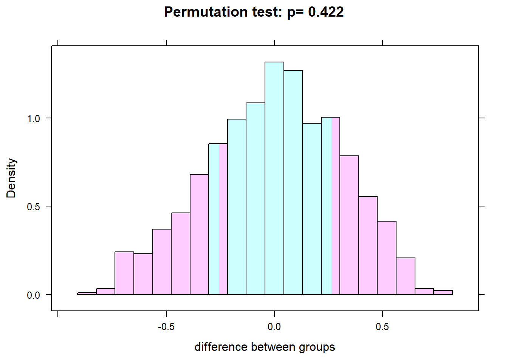
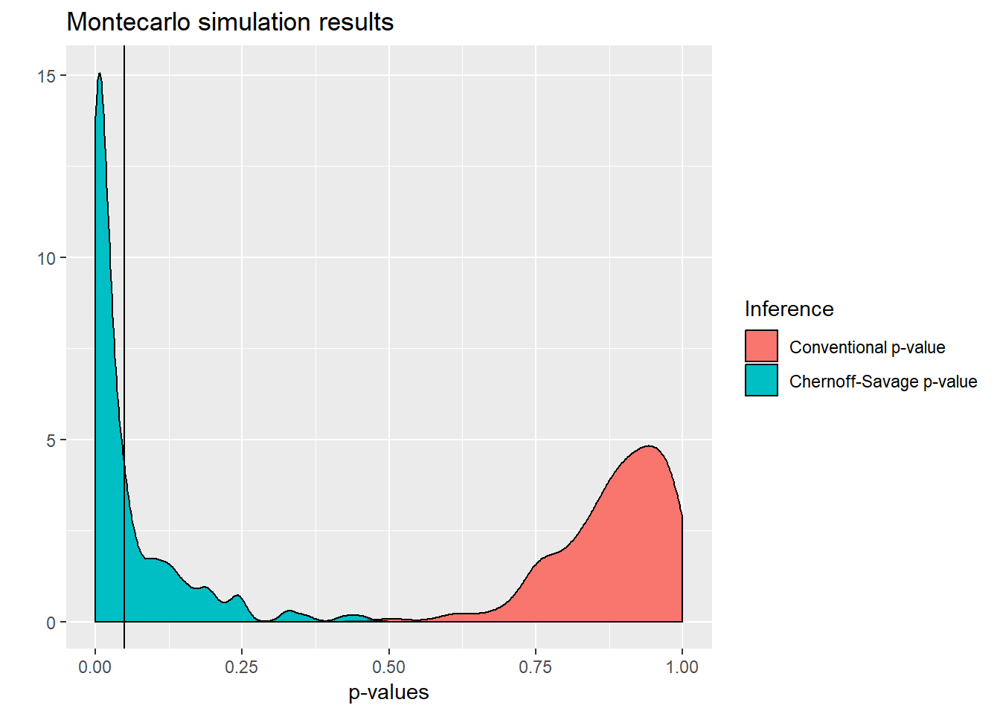

# Randomization


## Understanding the basics

@Athey2016

Let us write a very simple data-generating process (DGP) for a trivial RCT.


```r
library(mvtnorm)
set.seed(2001)
beta <- 0.5
sigma <- matrix(c(1.0,0.0,
                  0.0,1.0),ncol=2)

## Generate residuals and variables
N <- 20
m <- rmvnorm(N,mean=c(0,0),sigma=sigma)

## Write down the DGP:
Dstar <- m[,1]
D <- ifelse(Dstar>0,1,0)
Y <- beta*D + m[,2]
data <- data.frame(cbind(D,Y))
head(data)
```

```
##   D          Y
## 1 1 -0.2778131
## 2 0  0.3027668
## 3 1  1.3985959
## 4 1  1.1322528
## 5 1 -0.6073642
## 6 0  0.8978806
```

The standard way of doing the impact evaluation is then simply a comparison of means, which boils down to an OLS regression.


```r
summary(lm(Y ~ D))
```

```
## 
## Call:
## lm(formula = Y ~ D)
## 
## Residuals:
##     Min      1Q  Median      3Q     Max 
## -1.0354 -0.3314 -0.1213  0.2210  1.7923 
## 
## Coefficients:
##             Estimate Std. Error t value Pr(>|t|)
## (Intercept)   0.1647     0.2606   0.632    0.535
## D             0.2634     0.3233   0.815    0.426
## 
## Residual standard error: 0.6896 on 18 degrees of freedom
## Multiple R-squared:  0.03556,	Adjusted R-squared:  -0.01802 
## F-statistic: 0.6636 on 1 and 18 DF,  p-value: 0.4259
```

@Heckman96


## The randomista debate

@Deaton2010 
@Imbens10 
@Barrett2010 
@Ravallion2012 
@Deaton2016
@Ravallion2018

## Randomization inference

@Young2016a

The basic idea behind randomization inference is to do all of the permutations of treatment status `D`.
We can do this with the `mosaic` package.


```r
# How many unique permutations are there of treatment?
2^20
```

```
## [1] 1048576
```

```r
library(mosaic)
obsdiff = with(data, mean(Y[D==1]) - mean(Y[D==0]))
obsdiff
```

```
## [1] 0.2633623
```

```r
numsim = 1000
res = do(numsim) * lm(Y ~ shuffle(D), data=data)
pvalue = sum(abs(res$D) > abs(obsdiff)) / numsim
histogram(~ res$D, group = abs(res$D) > abs(obsdiff), 
          n=20, density=FALSE, data=res, xlab="difference between groups",
          main=paste("Permutation test: p=", pvalue))
```



Now do it properly using the `coin` package


```r
library(coin)
```

```
## Loading required package: survival
```

```r
oneway_test(Y ~ as.factor(D), alternative = "two.sided", data=data, distribution = "exact")
```

```
## 
## 	Exact Two-Sample Fisher-Pitman Permutation Test
## 
## data:  Y by as.factor(D) (0, 1)
## Z = -0.82194, p-value = 0.4364
## alternative hypothesis: true mu is not equal to 0
```

## Attempting to replicate a famous paper

Download the dataset which corresponds to @Duflo04 from: 

dataverse.harvard.edu/dataset.xhtml?persistentId=hdl:1902.1/USBFNOMLAT

Attempt to replicate Tables I, II, III, IV and V.     Rejoice when you are able to read in and merge the files.  Note that you will not even be able to replicate the first set of summary statistics.  Carry out randomization inference on the results presented in Tables III, IV and V.

ASK CARLOS FOR HIS SOLUTION TO THE 2017 PROBLEM SET 1

## RI does not always increase standard errors

The following constructs a DGP where conventional inference always fails to detect treatment effects which are present but whose mean is zero and whose distribution is bimodal (-1 and +1).

A rank-based RI test (Chernoff-Savage) can, on the other hand, easily pick up the treatment heterogeneity, as long as the bimodality of the treatment effects is sufficiently clear


```r
library(coin)
mc.rct <- function(N=100){

  ## Generate residuals/variables
  #N <- 100
  sig <- 10
  # Next specify absolute value of what will turn out to be a bimodal treatment effect
  alfa <- 1
  epsilonV <- rnorm(N, 0, sig)
  epsilon0 <- rnorm(N, 0, sig)
  epsilon1 <- rnorm(N, 0, sig)
  # Need to make the variance of the noise on treated individuals small enough
  # so that the bimodal nature of the treatment effects is not "drowned out"
  # by noise
  sig1 <- 0.1
  sig0 <- 1
  sigV <- 1
  ## Write down the DGP
  V  <- sigV*epsilonV
  U0 <- sig0*epsilon0
  U1 <- sig1*epsilon1
  # Put a "minus" sign here to get used to doing so in a probit or logit setup
  # in later work, as in the Heckman and Vytlacil canonical Roy model example
  Dstar <- - V
  D <- ifelse(Dstar>0,1,0)
  # The next 2 lines create the bimodal treatment effects of -1 and +1
  Hstar <- rnorm(N, 0, sig)
  H <- ifelse(Hstar>0,1,-1)
  # Generate potential outcomes
  Y1 <- H*alfa + U1
  Y0 <- U0
  # Generate observed outcome as in a Roy model
  Y <- D*Y1 + (1-D)*Y0
  # When running inside the loop to debug (i.e. not as a function) 
  # can check the distributions
  # of the two potential outcomes by simple histograms
  # hist(Y1)
  # hist(Y0)
  # One wants to make sure that hist(Y1) is nicely bimodal
  #########################################################
  ## Do conventional inference
  p.value_lm <- summary(lm(Y ~ -1 + D))$coefficients[,4]
  
  ## Do randomization inference
  # Use the Chernoff-Savage test 
  # This is because rank-based tests are better at picking
  # up the heterogeneity in treatment effects
  # Original reference is: Chernoff, H. and Savage, I. R. (1958): 
  # "Asymptotic Normality and Efficiency of Certain Nonparametric
  # Tests," Annals of Mathematical Statistics, 29(4):972-994.
  
  p.perm <- pvalue(savage_test(Y ~ as.factor(D), alternative = "two.sided", 
                               distribution = approximate(B=5000)))
  # Note that I approximate the test statistic through 5000 draws
  # Result is not very sensitive to this
  
  ###############################
  ## Collect and return results
  res <- c(p.value_lm, p.perm, N, sig)
  names(res) <- c("Conventional p-value", "Chernoff-Savage p-value", "N", "sig")
  return(res)
  
}


## Try the function once to make sure it works
mc.rct()
```

```
##    Conventional p-value Chernoff-Savage p-value                       N 
##               0.9036019               0.0042000             100.0000000 
##                     sig 
##              10.0000000
```

```r
## Run the DGP a total of "reps" times
reps <- 200
system.time(MC1 <- replicate(reps, mc.rct(N=100)))
```

```
##    user  system elapsed 
##    4.66    0.03    5.02
```

```r
# Note: As one increases sample size, the RI p-value collapses essentially to zero
# whereas the conventional p-value remains close to 1 !!!!

## Reshape data to have convenient form for graphs:
library(reshape2)
MC1_long <- melt(as.data.frame(t(MC1)), 
                 measure.vars=c("Conventional p-value", "Chernoff-Savage p-value"), 
                 variable.name="Inference")
# Since the distributions of the p-values are heavily skewed
# (to the left for RI and to the right for conventional)
# the median p-value is probably more informative
median(MC1_long$value[1:reps])
```

```
## [1] 0.8994118
```

```r
median(MC1_long$value[(reps+1):(2*reps)])
```

```
## [1] 0.0167
```

```r
## Now plot the resulting densities of p-values
library(ggplot2)
qplot(x=value, data=MC1_long, geom="density",fill=Inference)+geom_density( alpha=0.5)+
  xlim(c(0.00,1))+geom_vline(xintercept=0.05)+ggtitle("Montecarlo simulation results")+xlab("p-values")
```



There we go ! Conventional inference doesn't pick anything up (as expected) whereas the rank-based RI inference usually rejects the null

ADD ONE OF THE STUDENT SOLUTIONS TO THIS 2017 PROBLEM SET HERE

You should also read @Eble2017

## Placebo effects and (surprise) homo oeconomicus is alive and kicking

@Malani2006
@Bulte2014

## Re-introducing choice into randomizations

### Wing et al approach

@Wing2016


```r
library(randomizr)
N <- 1800
D <- complete_ra(N = N, num_arms = 3)
DC <- ifelse(D == "T1", 1, 0)
DT <- ifelse(D == "T2", 1, 0)
DP <- ifelse(D == "T3", 1, 0)
alfa <- 0.20
gamma <- 0.67
epsilon <- rnorm(N,0,1)
v <- rnorm(N,0,1)
sigv = -1.000
sig1 <- 0.12
sig0 <- -0.50
U1 <- sig1*epsilon
U0 <- sig0*epsilon
V <- sigv*v
#UD <- pnorm(V/(sigv))
Z <- rnorm(N,-0.0026,0.2700)
Choice <- Z - sigv*epsilon
T <- ifelse(Choice>0,1,0)
Y0 <- gamma        + U0
Y1 <- gamma + alfa + U1
Y <-  DC*Y0 + DT*Y1 + DP*((1-T)*Y0 +T*Y1)
DD <- DP*T
mean(DP*T)
```

```
## [1] 0.1705556
```

```r
summary(lm(Y ~ DT + DD))
```

```
## 
## Call:
## lm(formula = Y ~ DT + DD)
## 
## Residuals:
##      Min       1Q   Median       3Q      Max 
## -2.08005 -0.11488 -0.00061  0.14547  1.30549 
## 
## Coefficients:
##             Estimate Std. Error t value Pr(>|t|)    
## (Intercept)  0.79568    0.01199  66.360  < 2e-16 ***
## DT           0.07518    0.01891   3.975 7.32e-05 ***
## DD           0.16727    0.02371   7.056 2.43e-12 ***
## ---
## Signif. codes:  0 '***' 0.001 '**' 0.01 '*' 0.05 '.' 0.1 ' ' 1
## 
## Residual standard error: 0.3583 on 1797 degrees of freedom
## Multiple R-squared:  0.02868,	Adjusted R-squared:  0.0276 
## F-statistic: 26.53 on 2 and 1797 DF,  p-value: 4.415e-12
```

```r
write.csv(data.frame(cbind(Y, DC, DT, DP, DD)), file = "midterm.csv",row.names=FALSE)

summary(lm(Y ~ T))$coefficients[2,4]
```

```
## [1] 5.514916e-45
```

```r
library(coin)
pvalue(oneway_test(Y ~ as.factor(T), alternative = "two.sided",
                   distribution = c("asymptotic")))
```

```
## [1] 0
```

Your goal in this exercise is to delve more deeply into the paper by @Wing2016 that we saw in class.  Download the dataset midterm.csv.  The outcome variable is Y, the control arm dummy is DC, the treatment arm dummy is DT and the preference arm dummy is DP. The dummy DD is equal to one when an individual  in the preference arm took up treatment and zero otherwise.

Estimate the three treatment parameters (ATE, TT and TUT in the Heckman terminology). The Wing and Clark terminology is slightly different.  Test whether TT equals TUT using the SUR procedure suggested on p. 432, where you will pay particular attention to the dimensionality of the matrices involved.Do not worry about compliance issues.

INCLUDE A STUDENT ANSWER FROM THE 2018 MIDTERM

### RCTs as a principal-agent problem

The reintroduction of choice in order to identify the whole distribution of treatment effects is pushed to its logical conclusion in a remarkable paper by @Chassang2012, who place RCTs within the context of a principal-agent model.


