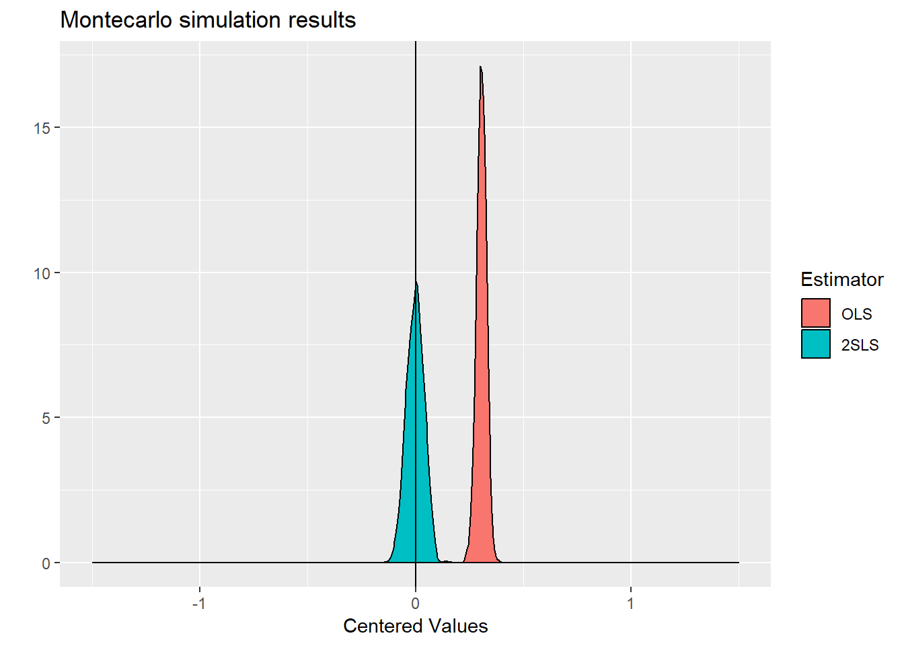
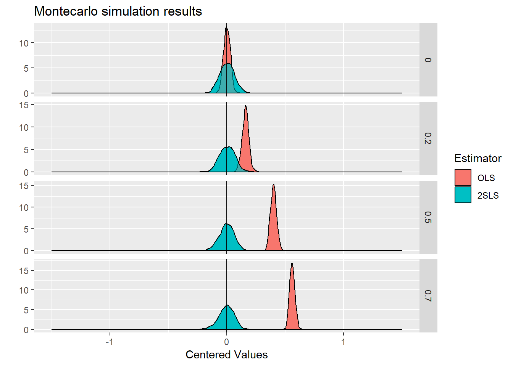
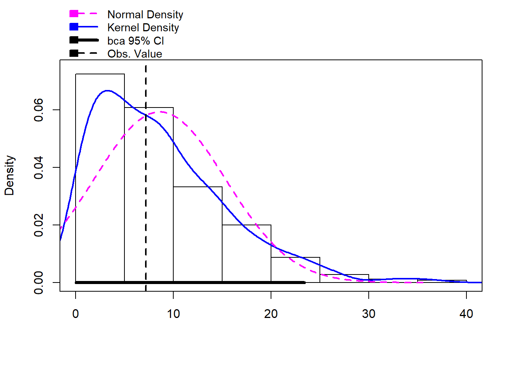
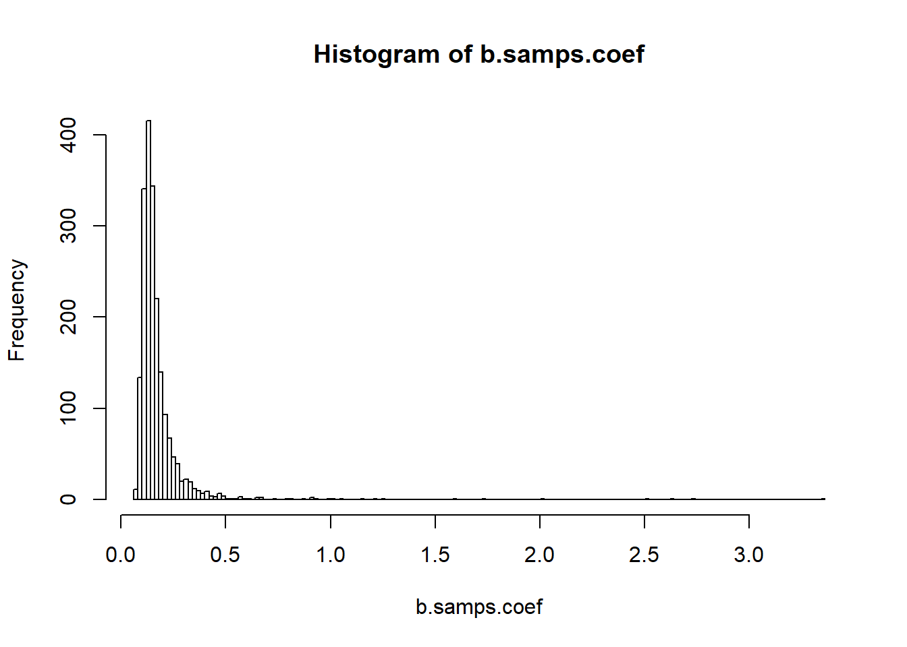

# IV and RDD

## The basics of IV

@Hausman83

Lecture notes on IV bias

### The forbidden regression

A common mistake in running IV regressions, especially when done in a two-step procedure, is what has memorably been termed by Jerry Hausman "the forbidden regression."

Lecture notes on the forbidden regression


```r
library(mvtnorm)
library(AER)
MC.endogeneity <- function(N=1000,covuud=0.5,covxz=0.5,alfa=1.0,pi=1.0, gamma=0.5, phi=0.0){
  ## Parameters
  beta <- 1.0
  sigma <- matrix(c(  1,covuud,    0,    0,
                 covuud,     1,    0,    0,
                      0,     0,    1,covxz,
                      0,     0,covxz,   1),ncol=4)
  
  ## generate residuals/variables 
  m <- rmvnorm(N,mean=c(0,0,0,0),sigma=sigma)
  Z <- matrix(m[,3],N,1)
  X <- matrix(m[,4],N,1)
  
  ## Generate DGP:
  D <- gamma*Z + pi*X           + m[,2]
  Y <- beta*D  + alfa*X + phi*Z + m[,1]
  
  
  ## Compute both estimators
  ols <- summary(lm(Y ~ -1 + D + X))$coefficients[1,1]
  tsls <- summary(ivreg(Y ~ -1 + D + X | X + Z))$coefficients[1,1]
  R <- summary(lm(D ~ -1 + Z))$residual
  forbidden <- summary(lm(Y ~ -1 + D + X + R))$coefficients[1,1]
  
  ## Collect and return results
  res <- c(ols, tsls, forbidden, N, covuud, gamma, phi)
  names(res) <- c("OLS", "2SLS", "forbidden", "N", "covuud", "gamma", "phi")
  return(res)
  
}

## Try function once
MC.endogeneity()
```

```
##         OLS        2SLS   forbidden           N      covuud       gamma 
##    1.388982    1.027740    1.239505 1000.000000    0.500000    0.500000 
##         phi 
##    0.000000
```

```r
## Run the DGP/estim 1000 times, with fixed parameters:
system.time(MC1 <- replicate(500, MC.endogeneity(N=1000,covuud=0.5,
                                                 covxz=-0.9,alfa=1.0,pi=1.0, 
                                                 gamma=0.5, phi=0.00)))
```

```
##    user  system elapsed 
##    8.71    0.06    8.96
```

```r
## Reshape data to have convenient form for graphs/tables:
library(reshape2)
MC1_long <- melt(as.data.frame(t(MC1)), measure.vars=c("OLS", "2SLS", "forbidden"), 
                 variable.name="Estimator")

## Visualise the data
library(ggplot2)
# Plot with fixed parameters
qplot(x=value-1, data=MC1_long, geom="density",fill=Estimator)+
  geom_density( alpha=0.5)+
  xlim(c(-1.0,1.0))+
  geom_vline(xintercept=0)+
  ggtitle("Montecarlo simulation results")+
  xlab("Centered Values")
```


```r
library(plyr)

MC_tab <- ddply(MC1_long, .(Estimator, N, covuud, gamma, phi), summarise, 
                means=mean(value, na.rm=TRUE), 
                bias=means -1, 
                var=var(value, na.rm=TRUE),
                mse=var+bias^2
)
MC_tab
```

```
##   Estimator    N covuud gamma phi     means         bias         var
## 1       OLS 1000    0.5   0.5   0 1.4780955  0.478095545 0.000769068
## 2      2SLS 1000    0.5   0.5   0 0.9992215 -0.000778495 0.023401337
## 3 forbidden 1000    0.5   0.5   0 2.1296752  1.129675155 0.033903588
##          mse
## 1 0.22934442
## 2 0.02340194
## 3 1.31006954
```

### Weak instruments


```r
library(mvtnorm)
MC.endogeneity <- function(N=100,cov=0.5, gamma=0.5, phi=0.0){
  ## Parameters
  beta <- 1.0
  sigma <- matrix(c(1,cov,0,
                    cov,1,0,
                    0,0,1),ncol=3)
  
  ## generate residuals/variables 
  m <- rmvnorm(N,mean=c(0,0,0),sigma=sigma)
  Z <- matrix(m[,3],N,1)
  
  ## Generate DGP:
  D <- gamma*Z + m[,2]
  Y <- beta*D + phi*Z + m[,1]
  
  ## Compute both estimators
  ols <- solve(crossprod(D))%*%crossprod(D,Y)
  tsls <- solve(crossprod(D,Z)%*%solve(crossprod(Z))%*%crossprod(Z,D))%*%
    crossprod(D,Z)%*%solve(crossprod(Z))%*%crossprod(Z,Y)
  
  ## Collect and return results
  res <- c(ols, tsls, N, cov, gamma, phi)
  names(res) <- c("OLS", "2SLS", "N", "cov", "gamma", "phi")
  return(res)
  
}

## Try function once
MC.endogeneity()
```

```
##        OLS       2SLS          N        cov      gamma        phi 
##   1.489416   1.284213 100.000000   0.500000   0.500000   0.000000
```

```r
## Run the DGP/estim 1000 times, with fixed parameters:
system.time(MC1 <- replicate(1000, MC.endogeneity(N=1000, cov=0.5, gamma=0.8, phi=0.0)))
```

```
##    user  system elapsed 
##    1.46    0.00    1.52
```

```r
## Reshape data to have convenient form for graphs/tables:
library(reshape2)
MC1_long <- melt(as.data.frame(t(MC1)), measure.vars=c("OLS", "2SLS"), 
                 variable.name="Estimator")
## Visualise the data
library(ggplot2)
# Plot with fixed parameters
qplot(x=value-1, data=MC1_long, geom="density",fill=Estimator)+
  geom_density( alpha=0.5)+
  xlim(c(-1.5,1.5))+
  geom_vline(xintercept=0)+
  ggtitle("Montecarlo simulation results")+
  xlab("Centered Values")
```



```r
##############################
# Examples of "faceted" graphs
##############################
library(plyr)
# Vary degree of endogeneity
MC_tab <- ddply(MC1_long, .(Estimator, N, cov, gamma, phi), summarise, 
                means=mean(value, na.rm=TRUE), 
                bias=means -1, 
                var=var(value, na.rm=TRUE),
                mse=var+bias^2
)
MC_tab
```

```
##   Estimator    N cov gamma phi     means         bias          var
## 1       OLS 1000 0.5   0.8   0 1.3026367  0.302636651 0.0005072339
## 2      2SLS 1000 0.5   0.8   0 0.9974945 -0.002505461 0.0016657861
##           mse
## 1 0.092096176
## 2 0.001672063
```

```r
## Run the DGP/estim 500 times, varying some parameters:
valgrid <- expand.grid(cov=c(0, 0.2, 0.5, 0.7), N=c(200, 500, 1000, 5000))
#valgrid <- expand.grid(gamma=c(0.01, 0.1, 0.2, 0.5), N=c(200, 500, 1000, 5000))

system.time(MCMC_mult_temp <- replicate(500, mapply(MC.endogeneity, N=valgrid$N, cov=valgrid$cov)))
```

```
##    user  system elapsed 
##   11.23    0.03   11.56
```

```r
#system.time(MCMC_mult_temp <- replicate(500, mapply(MC.endogeneity, N=valgrid$N, gamma=valgrid$gamma)))

# slower but more compact: system.time(MCMC_mult_temp <- replicate(500, t(mdply(valgrid, MC.endogeneity))))

MC_mult <- as.data.frame(MCMC_mult_temp)
MC_mult_long <- melt(as.data.frame(t(MC_mult)), measure.vars=c("OLS", "2SLS"), 
                     variable.name="Estimator")


# Plot with 1 parameter varying, this new dimension is shown with the "faceting" system
# as we represent according to one variable only, fix the N value:
MC_mult_long_N1000 <- subset(MC_mult_long,N==1000)

qplot(x=value-1, data=MC_mult_long_N1000, geom="density",fill=Estimator)+
  geom_density( alpha=0.5)+
  xlim(c(-1.5,1.5))+
  geom_vline(xintercept=0)+ggtitle("Montecarlo simulation results")+
  xlab("Centered Values")+
  facet_grid(cov~., scales="free")
```



```r
#facet_grid(gamma~., scales="free")

# Vary weakness of instruments

MC_tab <- ddply(MC1_long, .(Estimator, N, cov, gamma, phi), summarise, 
                means=mean(value, na.rm=TRUE), 
                bias=means -1, 
                var=var(value, na.rm=TRUE),
                mse=var+bias^2
)
MC_tab
```

```
##   Estimator    N cov gamma phi     means         bias          var
## 1       OLS 1000 0.5   0.8   0 1.3026367  0.302636651 0.0005072339
## 2      2SLS 1000 0.5   0.8   0 0.9974945 -0.002505461 0.0016657861
##           mse
## 1 0.092096176
## 2 0.001672063
```

```r
## Run the DGP/estim 500 times, varying some parameters:
#valgrid <- expand.grid(cov=c(0, 0.2, 0.5, 0.7), N=c(200, 500, 1000, 5000))
valgrid <- expand.grid(gamma=c(0.01, 0.1, 0.2, 0.5), N=c(200, 500, 1000, 5000))

#system.time(MCMC_mult_temp <- replicate(500, mapply(MC.endogeneity, N=valgrid$N, cov=valgrid$cov)))
system.time(MCMC_mult_temp <- replicate(500, mapply(MC.endogeneity, N=valgrid$N, gamma=valgrid$gamma)))
```

```
##    user  system elapsed 
##   11.00    0.00   11.09
```

```r
# slower but more compact: system.time(MCMC_mult_temp <- replicate(500, t(mdply(valgrid, MC.endogeneity))))

MC_mult <- as.data.frame(MCMC_mult_temp)
MC_mult_long <- melt(as.data.frame(t(MC_mult)), measure.vars=c("OLS", "2SLS"), 
                     variable.name="Estimator")


# Plot with 1 parameter varying, this new dimension is shown with the "faceting" system
# as we represent according to one variable only, fix the N value:
MC_mult_long_N1000 <- subset(MC_mult_long,N==1000)

qplot(x=value-1, data=MC_mult_long_N1000, geom="density",fill=Estimator)+
  geom_density( alpha=0.5)+
  xlim(c(-1.5,1.5))+
  geom_vline(xintercept=0)+ggtitle("Montecarlo simulation results")+
  xlab("Centered Values")+
  facet_grid(gamma~., scales="free")
```


```r
# facet_grid(cov~., scales="free")


library(plyr)

MC_mult_tab <- ddply(MC_mult_long, .(N, cov, gamma, phi, Estimator), summarise, 
                means=mean(value, na.rm=TRUE), 
                bias=means -1, 
                var=var(value, na.rm=TRUE),
                mse=var+bias^2
)
MC_mult_tab
```

```
##       N cov gamma phi Estimator     means         bias          var
## 1   200 0.5  0.01   0       OLS 1.4998284  0.499828380 3.530886e-03
## 2   200 0.5  0.01   0      2SLS 5.7153716  4.715371610 1.836021e+03
## 3   200 0.5  0.10   0       OLS 1.4914177  0.491417670 3.703796e-03
## 4   200 0.5  0.10   0      2SLS 1.0865304  0.086530435 1.434196e+01
## 5   200 0.5  0.20   0       OLS 1.4802542  0.480254158 3.705048e-03
## 6   200 0.5  0.20   0      2SLS 0.8829569 -0.117043142 1.518014e+00
## 7   200 0.5  0.50   0       OLS 1.3973522  0.397352157 3.142864e-03
## 8   200 0.5  0.50   0      2SLS 0.9929120 -0.007087998 2.133395e-02
## 9   500 0.5  0.01   0       OLS 1.5009023  0.500902331 1.620095e-03
## 10  500 0.5  0.01   0      2SLS 0.5320950 -0.467904992 2.617919e+02
## 11  500 0.5  0.10   0       OLS 1.4935015  0.493501499 1.459002e-03
## 12  500 0.5  0.10   0      2SLS 0.8730866 -0.126913388 3.924959e+00
## 13  500 0.5  0.20   0       OLS 1.4804724  0.480472386 1.467807e-03
## 14  500 0.5  0.20   0      2SLS 0.9557057 -0.044294349 6.658793e-02
## 15  500 0.5  0.50   0       OLS 1.3987708  0.398770833 1.206736e-03
## 16  500 0.5  0.50   0      2SLS 0.9947788 -0.005221248 7.910817e-03
## 17 1000 0.5  0.01   0       OLS 1.5006613  0.500661303 7.138467e-04
## 18 1000 0.5  0.01   0      2SLS 2.6874607  1.687460721 2.783818e+02
## 19 1000 0.5  0.10   0       OLS 1.4945968  0.494596825 7.975070e-04
## 20 1000 0.5  0.10   0      2SLS 0.9046770 -0.095323042 2.361009e-01
## 21 1000 0.5  0.20   0       OLS 1.4794720  0.479471961 7.795876e-04
## 22 1000 0.5  0.20   0      2SLS 0.9995210 -0.000478981 2.276189e-02
## 23 1000 0.5  0.50   0       OLS 1.3996580  0.399658002 6.424201e-04
## 24 1000 0.5  0.50   0      2SLS 0.9976934 -0.002306594 3.771407e-03
## 25 5000 0.5  0.01   0       OLS 1.5003544  0.500354382 1.383241e-04
## 26 5000 0.5  0.01   0      2SLS 2.5101899  1.510189935 6.067754e+02
## 27 5000 0.5  0.10   0       OLS 1.4952801  0.495280076 1.422040e-04
## 28 5000 0.5  0.10   0      2SLS 0.9883872 -0.011612780 2.072568e-02
## 29 5000 0.5  0.20   0       OLS 1.4802566  0.480256558 1.505576e-04
## 30 5000 0.5  0.20   0      2SLS 0.9935161 -0.006483867 4.759459e-03
## 31 5000 0.5  0.50   0       OLS 1.4000156  0.400015594 1.368521e-04
## 32 5000 0.5  0.50   0      2SLS 0.9977169 -0.002283081 8.256368e-04
##             mse
## 1  2.533593e-01
## 2  1.858256e+03
## 3  2.451951e-01
## 4  1.434945e+01
## 5  2.343491e-01
## 6  1.531713e+00
## 7  1.610316e-01
## 8  2.138419e-02
## 9  2.525232e-01
## 10 2.620108e+02
## 11 2.450027e-01
## 12 3.941066e+00
## 13 2.323215e-01
## 14 6.854992e-02
## 15 1.602249e-01
## 16 7.938078e-03
## 17 2.513756e-01
## 18 2.812294e+02
## 19 2.454235e-01
## 20 2.451874e-01
## 21 2.306729e-01
## 22 2.276212e-02
## 23 1.603689e-01
## 24 3.776727e-03
## 25 2.504928e-01
## 26 6.090561e+02
## 27 2.454446e-01
## 28 2.086054e-02
## 29 2.307969e-01
## 30 4.801500e-03
## 31 1.601493e-01
## 32 8.308493e-04
```


### Finite sample bias

@Hahn02a

## Bootstrap inference

@Young2017


```r
# Set Number of Digits
options(digits = 4)

############################################
# Now use real data (augmented AJR dataset)
############################################
library(foreign)
clean <-read.dta("ajr.dta")
summary(clean)
```

```
##     logpgp95         avexpr          logem4       gold_silv    
##  Min.   : 6.11   Min.   : 3.50   Min.   :2.15   Min.   :0.000  
##  1st Qu.: 7.33   1st Qu.: 5.64   1st Qu.:4.23   1st Qu.:0.000  
##  Median : 7.95   Median : 6.50   Median :4.36   Median :0.000  
##  Mean   : 8.08   Mean   : 6.56   Mean   :4.67   Mean   :0.328  
##  3rd Qu.: 8.84   3rd Qu.: 7.46   3rd Qu.:5.48   3rd Qu.:1.000  
##  Max.   :10.22   Max.   :10.00   Max.   :7.99   Max.   :1.000  
##    resources        lpd1500s         lpd1995         landlock     
##  Min.   :0.000   Min.   :-3.831   Min.   :0.854   Min.   :0.0000  
##  1st Qu.:0.000   1st Qu.:-0.038   1st Qu.:2.950   1st Qu.:0.0000  
##  Median :1.000   Median : 0.432   Median :3.718   Median :0.0000  
##  Mean   :0.639   Mean   : 0.449   Mean   :3.843   Mean   :0.0984  
##  3rd Qu.:1.000   3rd Qu.: 1.442   3rd Qu.:4.661   3rd Qu.:0.0000  
##  Max.   :1.000   Max.   : 4.610   Max.   :8.684   Max.   :1.0000  
##     lat_abst         f_spain          f_germ           f_brit     
##  Min.   :0.0000   Min.   :0.000   Min.   :0.0000   Min.   :0.000  
##  1st Qu.:0.0889   1st Qu.:0.000   1st Qu.:0.0000   1st Qu.:0.000  
##  Median :0.1500   Median :0.000   Median :0.0000   Median :0.000  
##  Mean   :0.1793   Mean   :0.262   Mean   :0.0328   Mean   :0.361  
##  3rd Qu.:0.2556   3rd Qu.:1.000   3rd Qu.:0.0000   3rd Qu.:1.000  
##  Max.   :0.6667   Max.   :1.000   Max.   :1.0000   Max.   :1.000  
##     f_pothco          africa          asia         shortnam        
##  Min.   :0.0000   Min.   :0.00   Min.   :0.000   Length:61         
##  1st Qu.:0.0000   1st Qu.:0.00   1st Qu.:0.000   Class :character  
##  Median :0.0000   Median :0.00   Median :0.000   Mode  :character  
##  Mean   :0.0328   Mean   :0.41   Mean   :0.147                     
##  3rd Qu.:0.0000   3rd Qu.:1.00   3rd Qu.:0.000                     
##  Max.   :1.0000   Max.   :1.00   Max.   :1.000
```

```r
#####################################
# Let's focus on the first stage
# and illustrate the boot command
#####################################
library(car)
library(boot)
set.seed(666)
# Original AJR type specification
first <- lm(avexpr~logem4+lat_abst+africa+asia, data=clean)
summary(first)
```

```
## 
## Call:
## lm(formula = avexpr ~ logem4 + lat_abst + africa + asia, data = clean)
## 
## Residuals:
##     Min      1Q  Median      3Q     Max 
## -2.8003 -0.9043  0.0861  0.8949  3.1346 
## 
## Coefficients:
##             Estimate Std. Error t value Pr(>|t|)    
## (Intercept)    8.348      0.923    9.05  1.5e-12 ***
## logem4        -0.472      0.176   -2.68   0.0096 ** 
## lat_abst       2.259      1.380    1.64   0.1073    
## africa        -0.101      0.416   -0.24   0.8088    
## asia           0.319      0.494    0.65   0.5212    
## ---
## Signif. codes:  0 '***' 0.001 '**' 0.01 '*' 0.05 '.' 0.1 ' ' 1
## 
## Residual standard error: 1.25 on 56 degrees of freedom
## Multiple R-squared:  0.32,	Adjusted R-squared:  0.271 
## F-statistic: 6.58 on 4 and 56 DF,  p-value: 0.000207
```

```r
linearHypothesis(first,c("logem4 = 0"),test="F")
```

```
## Linear hypothesis test
## 
## Hypothesis:
## logem4 = 0
## 
## Model 1: restricted model
## Model 2: avexpr ~ logem4 + lat_abst + africa + asia
## 
##   Res.Df  RSS Df Sum of Sq    F Pr(>F)   
## 1     57 98.6                            
## 2     56 87.4  1      11.2 7.19 0.0096 **
## ---
## Signif. codes:  0 '***' 0.001 '**' 0.01 '*' 0.05 '.' 0.1 ' ' 1
```

```r
system.time(first.boot <- Boot(first, R=1000))
```

```
##    user  system elapsed 
##    2.17    0.00    2.25
```

```r
summary(first.boot, high.moments=TRUE)
```

```
## 
## Number of bootstrap replications R = 1000 
##             original bootBias bootSE bootMed bootSkew bootKurtosis
## (Intercept)    8.348  0.00372  1.047   8.335   0.0416        0.234
## logem4        -0.472 -0.00074  0.203  -0.474  -0.1023        0.210
## lat_abst       2.259 -0.11526  1.466   2.303  -0.3693        0.402
## africa        -0.101  0.01307  0.372  -0.123   0.5226        0.840
## asia           0.319 -0.00307  0.527   0.302   0.1365        0.131
```

```r
#hist(first.boot, legend="separate")

bs <- function(formula, data, indices) {
  d <- data[indices,] 
  first <- lm(formula, data=d)
  partialF <- linearHypothesis(first,c("logem4 = 0"),test="F")[2,5]
  return(partialF) 
} 

bootF <- boot(data=clean, statistic=bs,R=500,formula=avexpr~logem4+lat_abst+africa+asia)
summary(bootF,high.moments=TRUE)
```

```
##     R original bootBias bootSE bootMed bootSkew bootKurtosis
## 1 500     7.19     1.41   6.72     7.3     1.09         1.27
```

```r
hist(bootF)
```



```r
boot.ci(bootF, type="bca")
```

```
## BOOTSTRAP CONFIDENCE INTERVAL CALCULATIONS
## Based on 500 bootstrap replicates
## 
## CALL : 
## boot.ci(boot.out = bootF, type = "bca")
## 
## Intervals : 
## Level       BCa          
## 95%   ( 0.031, 23.420 )  
## Calculations and Intervals on Original Scale
## Some BCa intervals may be unstable
```

```r
#################################################
# Something you should ALWAYS do, at a minimum
# Bootstrap the second stage since residual 
# for Durbin-Wu-Hausman test is generated
#################################################
first <- lm(avexpr ~ logem4 + lat_abst, data=clean)
res <- summary(first)$residual
structural <- lm(logpgp95 ~ avexpr + lat_abst + res, data=clean)
summary(structural)
```

```
## 
## Call:
## lm(formula = logpgp95 ~ avexpr + lat_abst + res, data = clean)
## 
## Residuals:
##    Min     1Q Median     3Q    Max 
## -2.048 -0.227  0.032  0.403  1.163 
## 
## Coefficients:
##             Estimate Std. Error t value Pr(>|t|)    
## (Intercept)    2.079      0.770    2.70  0.00911 ** 
## avexpr         0.932      0.131    7.13  1.9e-09 ***
## lat_abst      -0.620      0.806   -0.77  0.44534    
## res           -0.569      0.146   -3.90  0.00025 ***
## ---
## Signif. codes:  0 '***' 0.001 '**' 0.01 '*' 0.05 '.' 0.1 ' ' 1
## 
## Residual standard error: 0.607 on 57 degrees of freedom
## Multiple R-squared:  0.666,	Adjusted R-squared:  0.648 
## F-statistic: 37.8 on 3 and 57 DF,  p-value: 1.37e-13
```

```r
system.time(structural.boot <- Boot(structural, R=1000))
```

```
##    user  system elapsed 
##    1.62    0.00    1.67
```

```r
summary(structural.boot)
```

```
## 
## Number of bootstrap replications R = 1000 
##             original bootBias bootSE bootMed
## (Intercept)    2.079  0.00733  0.744   2.041
## avexpr         0.932 -0.00171  0.134   0.941
## lat_abst      -0.620  0.04108  0.840  -0.628
## res           -0.569  0.00675  0.168  -0.579
```

```r
hist(structural.boot, legend="separate")
```


```r
confint(structural, level=.95, type="bca")
```

```
##               2.5 %  97.5 %
## (Intercept)  0.5373  3.6211
## avexpr       0.6707  1.1942
## lat_abst    -2.2344  0.9950
## res         -0.8613 -0.2773
```

```r
############################################
# Now bootstrap the IV results themselves
############################################
library(AER)
iv <- ivreg(logpgp95 ~ avexpr + lat_abst | lat_abst + logem4, data=clean)
summary(iv)
```

```
## 
## Call:
## ivreg(formula = logpgp95 ~ avexpr + lat_abst | lat_abst + logem4, 
##     data = clean)
## 
## Residuals:
##     Min      1Q  Median      3Q     Max 
## -2.4294 -0.6132  0.0638  0.6804  1.7229 
## 
## Coefficients:
##             Estimate Std. Error t value Pr(>|t|)    
## (Intercept)    2.079      1.173    1.77    0.082 .  
## avexpr         0.932      0.199    4.68  1.8e-05 ***
## lat_abst      -0.620      1.229   -0.50    0.616    
## ---
## Signif. codes:  0 '***' 0.001 '**' 0.01 '*' 0.05 '.' 0.1 ' ' 1
## 
## Residual standard error: 0.925 on 58 degrees of freedom
## Multiple R-Squared: 0.21,	Adjusted R-squared: 0.183 
## Wald test: 17.6 on 2 and 58 DF,  p-value: 1.03e-06
```

```r
ivboot <- Boot(iv,R=2000)
summary(ivboot)
```

```
## 
## Number of bootstrap replications R = 2000 
##             original bootBias bootSE bootMed
## (Intercept)    2.079   -0.831   6.15   2.072
## avexpr         0.932    0.139   1.07   0.932
## lat_abst      -0.620   -0.452   4.81  -0.579
```

```r
#hist(ivboot, xlim=c(-8, 4), legend="separate")
hist(ivboot, xlim=c(0, 2), legend="separate")
```


```r
confint(ivboot, level=.95, type="bca")
```

```
## Bootstrap bca confidence intervals
## 
##              2.5 % 97.5 %
## (Intercept) -8.583  3.789
## avexpr       0.655  2.690
## lat_abst    -7.923  1.426
```

```r
#####################################
# Now let's bootstrap the 2sls 
# results by hand by resampling
#####################################

first <- lm(avexpr ~ logem4 + lat_abst, data=clean)
res <- summary(first)$residual
structural <- lm(logpgp95 ~ avexpr + lat_abst + res, data=clean)
summary(structural)
```

```
## 
## Call:
## lm(formula = logpgp95 ~ avexpr + lat_abst + res, data = clean)
## 
## Residuals:
##    Min     1Q Median     3Q    Max 
## -2.048 -0.227  0.032  0.403  1.163 
## 
## Coefficients:
##             Estimate Std. Error t value Pr(>|t|)    
## (Intercept)    2.079      0.770    2.70  0.00911 ** 
## avexpr         0.932      0.131    7.13  1.9e-09 ***
## lat_abst      -0.620      0.806   -0.77  0.44534    
## res           -0.569      0.146   -3.90  0.00025 ***
## ---
## Signif. codes:  0 '***' 0.001 '**' 0.01 '*' 0.05 '.' 0.1 ' ' 1
## 
## Residual standard error: 0.607 on 57 degrees of freedom
## Multiple R-squared:  0.666,	Adjusted R-squared:  0.648 
## F-statistic: 37.8 on 3 and 57 DF,  p-value: 1.37e-13
```

```r
N <- nrow(clean)
bootstrap <- function(out = "coef") {
  b.samp <- sample(N, replace = TRUE)
  b.first <- lm(avexpr ~ logem4 + lat_abst, data=clean[b.samp, ])
  b.res <- summary(b.first)$residual
  b.structural <- lm(logpgp95 ~ avexpr + lat_abst + b.res, data=clean[b.samp, ])
  if (out == "coef") {
    out <- summary(b.structural)$coefficients[2, 2]
  } else {
    stop("Unknown output statistic.")
  }
  out
}
b.samps.coef <- replicate(1000, bootstrap(out = "coef"))
hist(b.samps.coef, breaks=200)
```


```r
#hist(b.samps.coef, xlim=c(-1,3), breaks=200)
c(summary(structural)$coefficients[2, 2], sd(b.samps.coef))
```

```
## [1] 0.1307 0.7954
```

```r
# Bootstrap the Durbin-Wu-Hausman statistic manually through resampling
N <- nrow(clean)
bootstrap <- function(out = "coef") {
  b.samp <- sample(N, replace = TRUE)
  b.first <- lm(avexpr ~ logem4 + lat_abst, data=clean[b.samp, ])
  b.res <- summary(b.first)$residual
  b.structural <- lm(logpgp95 ~ avexpr + lat_abst + b.res, data=clean[b.samp, ])
  if (out == "coef") {
    out <- summary(b.structural)$coefficients[4, 2]
  } else {
    stop("Unknown output statistic.")
  }
  out
}
b.samps.coef <- replicate(2000, bootstrap(out = "coef"))
hist(b.samps.coef, breaks=200)
```



```r
#hist(b.samps.coef, xlim=c(-1,3), breaks=200)
c(summary(structural)$coefficients[4, 2], sd(b.samps.coef))
```

```
## [1] 0.1458 0.1663
```

The basic lesson is that you shouldn't forget to the do the Hausman test of the null of exogeneity

## Failure of the exclusion restriction

@Conley2012


```r
##################################################################
# One last small useful IV tool
# Conley, Hansen and Rossi (2012)
# Sensitivity of IV results to violation of exclusion restriction
##################################################################
# Intuition
phi <- seq(-1, 1, 0.1)
violation <- function(g) {
  YY <- clean$logpgp95 - g * clean$logem4
  rbind(g, summary(ivreg(YY ~ avexpr + lat_abst, ~logem4 + lat_abst, 
             cbind(clean, YY)))$coef[2,1],
        summary(ivreg(YY ~ avexpr + lat_abst, ~logem4 + lat_abst, 
                      cbind(clean, YY)))$coef[2,2])
}
altcoefs <- sapply(phi, violation)
rownames(altcoefs) <- c("phi","coef","se")
round(altcoefs, 3)
```

```
##        [,1]   [,2]   [,3]   [,4]   [,5]   [,6]   [,7]   [,8]   [,9]  [,10]
## phi  -1.000 -0.900 -0.800 -0.700 -0.600 -0.500 -0.400 -0.300 -0.200 -0.100
## coef -0.951 -0.763 -0.574 -0.386 -0.198 -0.009  0.179  0.367  0.556  0.744
## se    0.372  0.326  0.281  0.237  0.197  0.163  0.139  0.130  0.139  0.164
##      [,11] [,12] [,13] [,14] [,15] [,16] [,17] [,18] [,19] [,20] [,21]
## phi  0.000 0.100 0.200 0.300 0.400 0.500 0.600 0.700 0.800 0.900 1.000
## coef 0.932 1.121 1.309 1.498 1.686 1.874 2.063 2.251 2.439 2.628 2.816
## se   0.199 0.239 0.283 0.328 0.375 0.422 0.470 0.518 0.567 0.615 0.664
```

```r
# + new package I have been playing with when you only have one jointly
# endogenous RHS variable: ivmodel
library(ivmodel)
model <-  ivmodelFormula(logpgp95 ~ avexpr + lat_abst | lat_abst + logem4, data=clean)
summary(model)
```

```
## 
## Call:
## ivmodel(Y = Y, D = D, Z = Z, intercept = intercept, beta0 = beta0, 
##     alpha = alpha, k = k, heteroSE = heteroSE, clusterID = clusterID, 
##     deltarange = deltarange, na.action = na.action)
## sample size: 61
## _ _ _ _ _ _ _ _ _ _ _ _ _ _ _ _ _ _ _ _ _ _ _ _ _ _ _ _ _ _ 
## 
## First Stage Regression Result:
## 
## F=23.46, df1=1, df2=59, p-value is 9.6e-06
## R-squared=0.2845,   Adjusted R-squared=0.2724
## Residual standard error: 1.248 on 60 degrees of freedom
## _ _ _ _ _ _ _ _ _ _ _ _ _ _ _ _ _ _ _ _ _ _ _ _ _ _ _ _ _ _ 
## 
## Coefficients of k-Class Estimators:
## 
##             k Estimate Std. Error t value Pr(>|t|)    
## OLS    0.0000   0.5197     0.0609    8.53  7.1e-12 ***
## Fuller 0.9831   0.8662     0.1392    6.22  5.5e-08 ***
## LIML   1.0000   0.8872     0.1453    6.11  8.6e-08 ***
## TSLS   1.0000   0.8872     0.1453    6.11  8.6e-08 ***
## ---
## Signif. codes:  0 '***' 0.001 '**' 0.01 '*' 0.05 '.' 0.1 ' ' 1
## _ _ _ _ _ _ _ _ _ _ _ _ _ _ _ _ _ _ _ _ _ _ _ _ _ _ _ _ _ _ 
## 
## Alternative tests for the treatment effect under H_0: beta=0.
## 
## Anderson-Rubin test:
## F=49.81, df1=1, df2=59, p-value=2.2e-09
## 95 percent confidence interval:
##  [ 0.656704700430494 , 1.32915681156195 ]
## 
## Conditional Likelihood Ratio test:
## Test Stat=49.81, p-value=2.2e-09
## 95 percent confidence interval:
##  [0.656704748900843, 1.32915663344458]
```

## The GMM black box

@Bazzi2013
@Harding2015

## Regression discontinuity design

@Imbens2008
@Lee10

### Application to a development program

### Pushing the outcome variable


