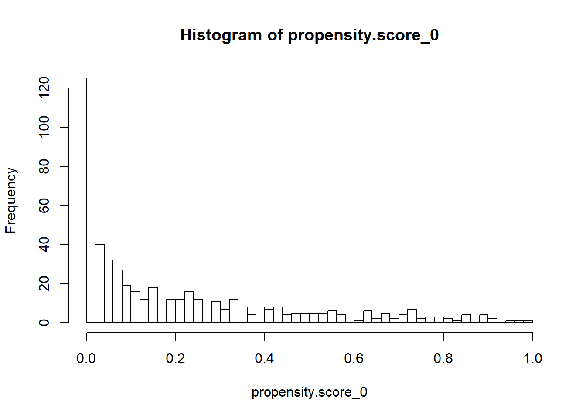
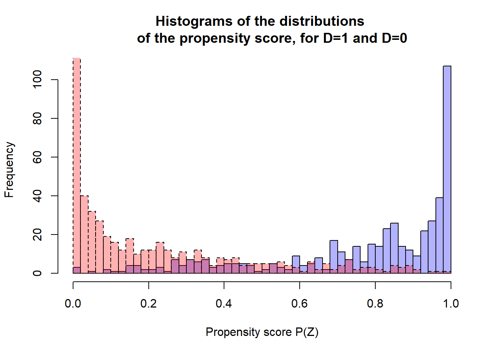
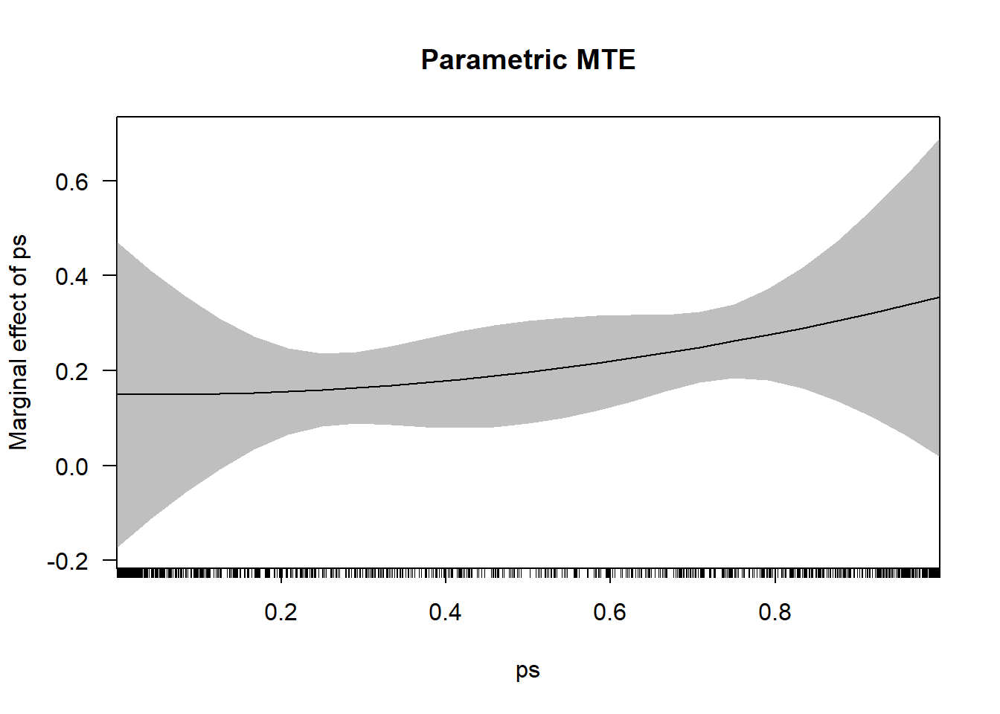
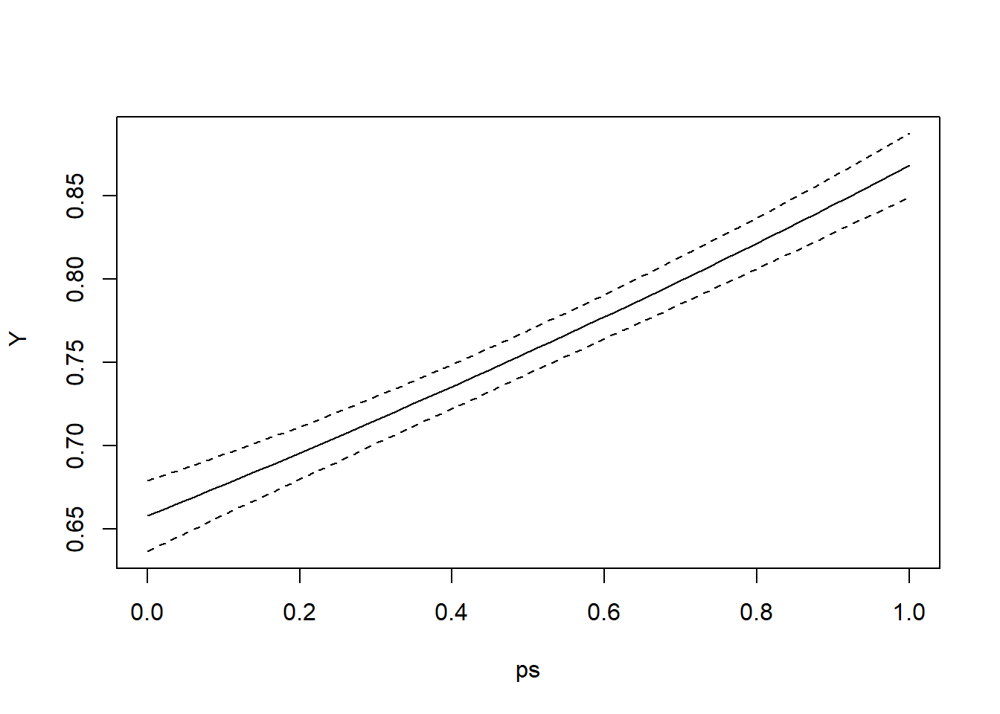
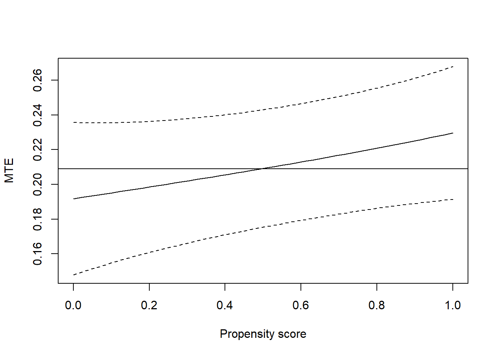
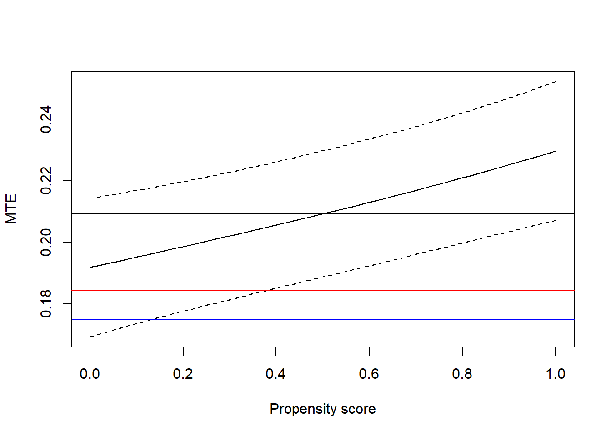
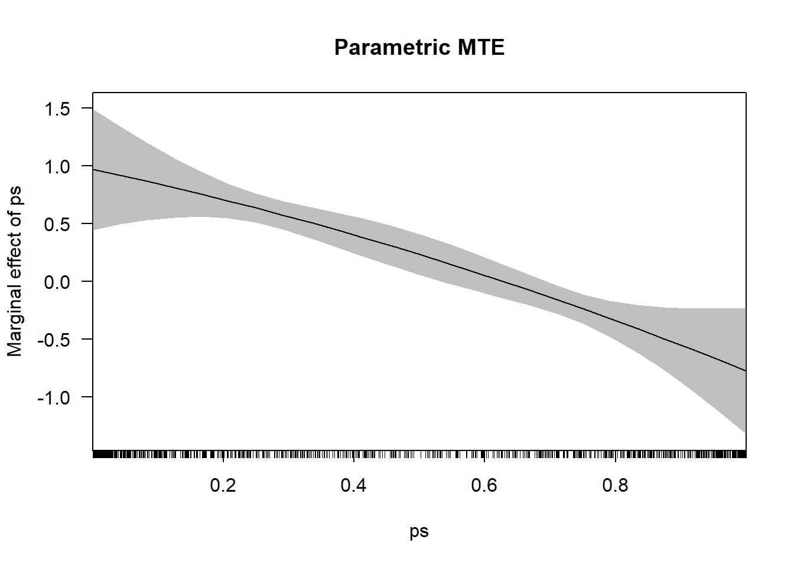
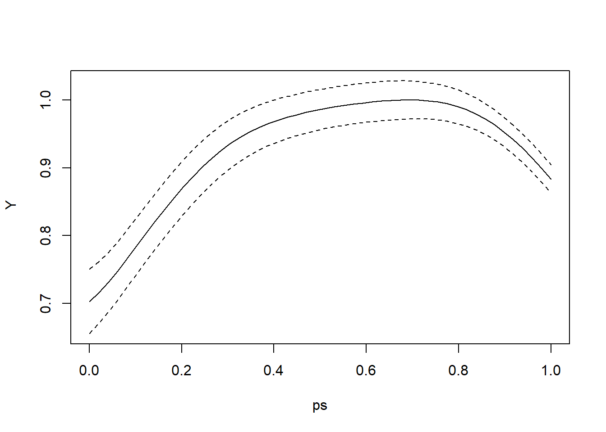
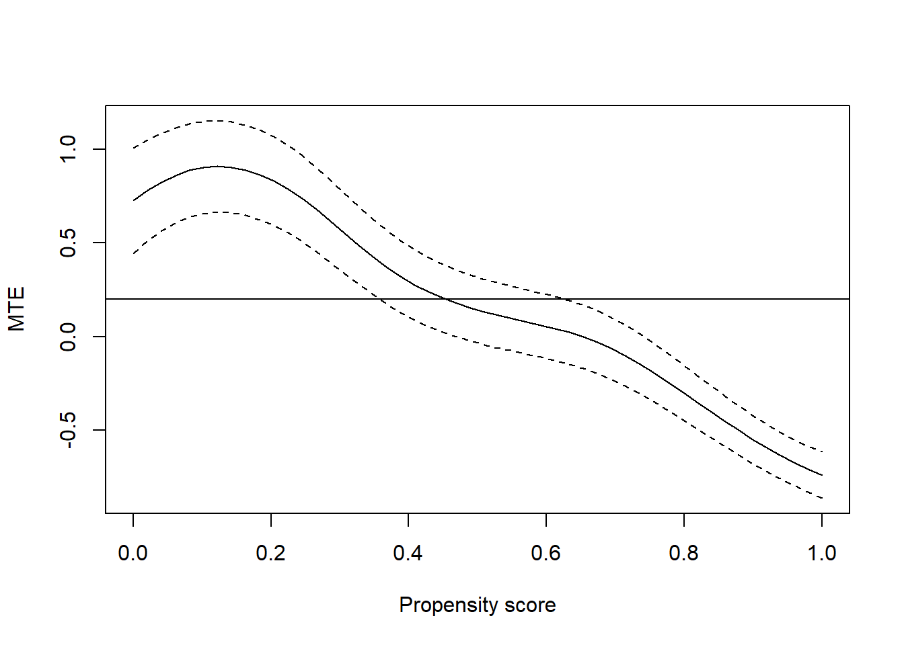
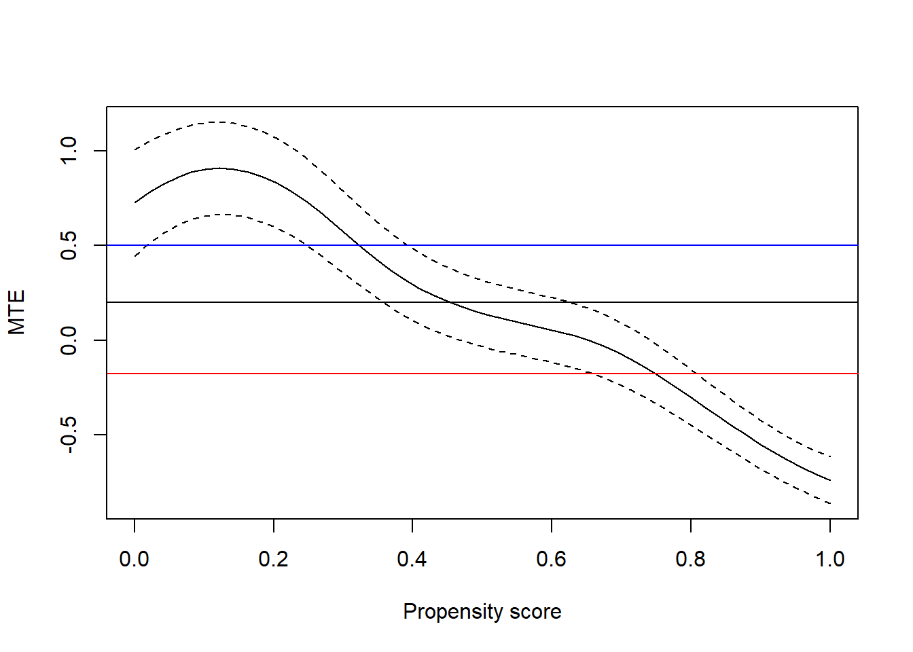

# Heterogeneity in various flavors

Heterogeneity appears in various forms in impact evaluation.  But it is pretty safe to say that there are two main varieties: (i) heterogeneity which depends on the LHS variable and (ii) that which depends on RHS variables.  

## Quantile regressions and random coefficient models

@Koenker01
@Beck2007

## Essential heterogeneity

@Heckman99a
@Heckman06
@Heckman03
@Ravallion2015

We begin by illustrating what happens when a model is affected by a small amount of essential heterogeneity.


```r
# Model with very little essential heterogeneity

set.seed(14381)
N <- 1000
alfa <- 0.20
gamma <- 0.67
epsilon <- rnorm(N,0,1)
sigv = -1.000
sig1 <- 0.12
sig0 <- 0.18
U1 <- sig1*epsilon
U0 <- sig0*epsilon
V <- sigv*epsilon
UD <- pnorm(V/(sigv))
#hist(V)
#hist(UD)
Z <- rnorm(N,-0.026,1.700)
Dstar <- Z - V
D <- ifelse(Dstar>0,1,0)
Y1 <- gamma + alfa + U1
Y0 <- gamma        + U0
Y <- D*Y1 + (1-D)*Y0
# summary(lm(Y ~ D))
# deltaY <- Y1 - Y0
# plot(UD,deltaY)

# Estimate the discrete choice model in
# order to construct the propensity score P(Z)

D.probit <- glm(D ~ Z, family=binomial(link="probit"))
summary(D.probit)
```

```
## 
## Call:
## glm(formula = D ~ Z, family = binomial(link = "probit"))
## 
## Deviance Residuals: 
##     Min       1Q   Median       3Q      Max  
## -3.0250  -0.5185  -0.0157   0.5535   3.3438  
## 
## Coefficients:
##             Estimate Std. Error z value Pr(>|z|)    
## (Intercept) -0.02779    0.05379  -0.517    0.605    
## Z            1.00065    0.05602  17.861   <2e-16 ***
## ---
## Signif. codes:  0 '***' 0.001 '**' 0.01 '*' 0.05 '.' 0.1 ' ' 1
## 
## (Dispersion parameter for binomial family taken to be 1)
## 
##     Null deviance: 1385.39  on 999  degrees of freedom
## Residual deviance:  697.83  on 998  degrees of freedom
## AIC: 701.83
## 
## Number of Fisher Scoring iterations: 6
```

```r
propensity.score <- predict(D.probit, type="response")
summary(propensity.score)
```

```
##      Min.   1st Qu.    Median      Mean   3rd Qu.      Max. 
## 0.0000009 0.1004398 0.4555289 0.4857720 0.8551697 1.0000000
```

```r
# Consider the propensity score separately
# for treated and untreated individuals

D1 <- ifelse(D == 1, 1, NA)
D0 <- ifelse(D == 0, 1, NA)
propensity.score_1 <- na.omit(propensity.score*D1)
propensity.score_0 <- na.omit(propensity.score*D0)
summary(propensity.score_1)
```

```
##     Min.  1st Qu.   Median     Mean  3rd Qu.     Max. 
## 0.003733 0.666955 0.852936 0.771470 0.971597 1.000000
```

```r
summary(propensity.score_0)
```

```
##      Min.   1st Qu.    Median      Mean   3rd Qu.      Max. 
## 0.0000009 0.0209205 0.1129155 0.2167163 0.3300500 0.9896955
```

```r
# Check for range of common support

CS_min <- max(min(propensity.score_1),min(propensity.score_0))
CS_max <- min(max(propensity.score_1),max(propensity.score_0))
CS <- cbind(CS_min,CS_max)
CS_dummy_min <- ifelse(CS_min <= propensity.score,1,NA)
CS_dummy_max <- ifelse(propensity.score <= CS_max,1,NA)
CS_dummy <- CS_dummy_min*CS_dummy_max
summary(CS_dummy)
```

```
##    Min. 1st Qu.  Median    Mean 3rd Qu.    Max.    NA's 
##       1       1       1       1       1       1     142
```

```r
CS
```

```
##           CS_min    CS_max
## [1,] 0.003733127 0.9896955
```

```r
# Construct histograms of propensity score
# for treated and untreated individuals

propensity.score.hist_1 <- hist(propensity.score_1, br=50)
```


```r
propensity.score.hist_0 <- hist(propensity.score_0, br=50)
```



```r
plot(propensity.score.hist_1,main="Histograms of the distributions 
     of the propensity score, for D=1 and D=0",xlab="Propensity score P(Z)", col=adjustcolor("blue", 0.3))
lines(propensity.score.hist_0, lty=2, col=adjustcolor("red", 0.3))

ps <- propensity.score
heckman <- as.data.frame(cbind(Y,D,Z,ps))
attach(heckman)

# Compute simple linear IV estimate

library(AER)
```



```r
lineariv <- ivreg(Y ~ D | ps, data=heckman)
summary(lineariv)
```

```
## 
## Call:
## ivreg(formula = Y ~ D | ps, data = heckman)
## 
## Residuals:
##      Min       1Q   Median       3Q      Max 
## -0.51552 -0.09237  0.00592  0.09789  0.38830 
## 
## Coefficients:
##             Estimate Std. Error t value Pr(>|t|)    
## (Intercept) 0.654443   0.007836   83.52   <2e-16 ***
## D           0.208293   0.012796   16.28   <2e-16 ***
## ---
## Signif. codes:  0 '***' 0.001 '**' 0.01 '*' 0.05 '.' 0.1 ' ' 1
## 
## Residual standard error: 0.1513 on 998 degrees of freedom
## Multiple R-Squared: 0.4932,	Adjusted R-squared: 0.4927 
## Wald test:   265 on 1 and 998 DF,  p-value: < 2.2e-16
```

```r
# Estimate the linear treatment model with the estimated propensity score P(Z)
# Include quadratic and cubic terms in order to test for the presence of 
# essential heterogeneity

# Test the joint significance of the quadratic and cubic terms

ps_2 <- ps^2
ps_3 <- ps^3
Y.ps1 <- lm(Y ~ ps + ps_2 + ps_3, data = heckman)
summary(Y.ps1)
```

```
## 
## Call:
## lm(formula = Y ~ ps + ps_2 + ps_3, data = heckman)
## 
## Residuals:
##      Min       1Q   Median       3Q      Max 
## -0.69597 -0.12222  0.00264  0.13355  0.52701 
## 
## Coefficients:
##             Estimate Std. Error t value Pr(>|t|)    
## (Intercept)  0.66244    0.01466  45.181   <2e-16 ***
## ps           0.14933    0.16461   0.907    0.365    
## ps_2        -0.00775    0.41133  -0.019    0.985    
## ps_3         0.07365    0.27257   0.270    0.787    
## ---
## Signif. codes:  0 '***' 0.001 '**' 0.01 '*' 0.05 '.' 0.1 ' ' 1
## 
## Residual standard error: 0.1977 on 996 degrees of freedom
## Multiple R-squared:  0.1364,	Adjusted R-squared:  0.1338 
## F-statistic: 52.44 on 3 and 996 DF,  p-value: < 2.2e-16
```

```r
library(car)
linearHypothesis(Y.ps1, c("ps_2 = 0", "ps_3 = 0"))
```

```
## Linear hypothesis test
## 
## Hypothesis:
## ps_2 = 0
## ps_3 = 0
## 
## Model 1: restricted model
## Model 2: Y ~ ps + ps_2 + ps_3
## 
##   Res.Df    RSS Df Sum of Sq      F Pr(>F)
## 1    998 39.005                           
## 2    996 38.922  2  0.083118 1.0635 0.3456
```

```r
# Calculate the MTE parametrically

library(margins)
Y.ps2 <- lm(Y ~ ps + I(ps^2) + I(ps^3), data = heckman)
cplot(Y.ps2, "ps", what = "effect", main = "Parametric MTE")
```



```r
# Nonparametric specification

library(np)

# Use a simple local linear regression with 
# bootstrapped or asymptotic standard errors

bw0 <- npregbw(xdat=ps, ydat=Y, regtype="ll", bwmethod="cv.aic")
```

```
## 
Multistart 1 of 1 |
Multistart 1 of 1 |
Multistart 1 of 1 |
Multistart 1 of 1 /
Multistart 1 of 1 |
Multistart 1 of 1 |
                   
```

```r
Y.np0 <- npreg(bws = bw0, gradient=TRUE)
summary(Y.np0)
```

```
## 
## Regression Data: 1000 training points, in 1 variable(s)
##                      ps
## Bandwidth(s): 0.4379313
## 
## Kernel Regression Estimator: Local-Linear
## Bandwidth Type: Fixed
## Residual standard error: 0.1974078
## R-squared: 0.1353268
## 
## Continuous Kernel Type: Second-Order Gaussian
## No. Continuous Explanatory Vars.: 1
```

```r
plot(Y.np0, plot.errors.method="bootstrap")
```



```r
plot(Y.np0, plot.errors.method="bootstrap", gradient=TRUE, 
     ylab="MTE", xlab="Propensity score")
# The MTE is valid over the region of common support
mte <- Y.np0$grad*CS_dummy
ATE <- mean(mte, na.rm=TRUE)
abline(h=ATE)
```



```r
mte_se <- Y.np0$gerr*CS_dummy
ATE_se <- mean(mte_se, na.rm=TRUE)

# Compute the treatment weights

uD <- qnorm(ps)
P.probit <- glm(D ~ uD, family=binomial(link="probit"))
summary(P.probit)
```

```
## 
## Call:
## glm(formula = D ~ uD, family = binomial(link = "probit"))
## 
## Deviance Residuals: 
##     Min       1Q   Median       3Q      Max  
## -3.0250  -0.5185  -0.0157   0.5535   3.3438  
## 
## Coefficients:
##               Estimate Std. Error z value Pr(>|z|)    
## (Intercept) -5.672e-17  5.378e-02    0.00        1    
## uD           1.000e+00  5.599e-02   17.86   <2e-16 ***
## ---
## Signif. codes:  0 '***' 0.001 '**' 0.01 '*' 0.05 '.' 0.1 ' ' 1
## 
## (Dispersion parameter for binomial family taken to be 1)
## 
##     Null deviance: 1385.39  on 999  degrees of freedom
## Residual deviance:  697.83  on 998  degrees of freedom
## AIC: 701.83
## 
## Number of Fisher Scoring iterations: 6
```

```r
omega_TT_n <- 1 - predict(P.probit, type="response")
omega_TT_d <- sum(omega_TT_n)
omega_TT <- omega_TT_n / omega_TT_d
omega_TUT_n <- predict(P.probit, type="response")
omega_TUT_d <- sum(omega_TUT_n)
omega_TUT <- omega_TUT_n / omega_TUT_d
check <- sum(omega_TT)
print(check)
```

```
## [1] 1
```

```r
TT <- sum(omega_TT*mte, na.rm=TRUE)
TT_se <- sum(omega_TT*mte_se, na.rm=TRUE)
TUT <- sum(omega_TUT*mte, na.rm=TRUE)
TUT_se <- sum(omega_TUT*mte_se, na.rm=TRUE)
parameters <- cbind("", "ATE", "TT", "TUT")
mean.effects <- cbind("Parameter", round(ATE,digits=3),round(TT,digits=3),round(TUT,digits=3))
mean.effects_se <- cbind("s.e", round(ATE_se,digits=3), round(TT_se,digits=3), round(TUT_se,digits=3))
print("Region of common support")
```

```
## [1] "Region of common support"
```

```r
print(CS)
```

```
##           CS_min    CS_max
## [1,] 0.003733127 0.9896955
```

```r
effects <- rbind(parameters, mean.effects, mean.effects_se)
print(effects)
```

```
##      [,1]        [,2]    [,3]    [,4]   
## [1,] ""          "ATE"   "TT"    "TUT"  
## [2,] "Parameter" "0.209" "0.175" "0.184"
## [3,] "s.e"       "0.011" "0.009" "0.009"
```

```r
plot(Y.np0, plot.errors.method="asymptotic", gradient=TRUE, 
     ylab="MTE", xlab="Propensity score")
abline(h=ATE, lty=1)
abline(h=TT, lty=1, col="blue")
abline(h=TUT, lty=1, col="red")
```




```r
# MODEL WITH ESSENTIAL HETEROGENEITY

set.seed(14381)
N <- 1000
alfa <- 0.20
gamma <- 0.67
epsilon <- rnorm(N,0,1)
sigv = -1.000
sig1 <- 0.12
sig0 <- -0.50
U1 <- sig1*epsilon
U0 <- sig0*epsilon
V <- sigv*epsilon
# UD <- pnorm(V/(sigv))
# hist(UD)
Z <- rnorm(N,-0.026,1.700)
Dstar <- Z - V
D <- ifelse(Dstar>0,1,0)
Y1 <- gamma + alfa + U1
Y0 <- gamma        + U0
Y <- D*Y1 + (1-D)*Y0
# summary(lm(Y ~ D))
# deltaY <- Y1 - Y0
# plot(UD,deltaY)
# 

# Estimate the discrete choice model in
# order to construct the propensity score P(Z)

D.probit <- glm(D ~ Z, family=binomial(link="probit"))
summary(D.probit)
```

```
## 
## Call:
## glm(formula = D ~ Z, family = binomial(link = "probit"))
## 
## Deviance Residuals: 
##     Min       1Q   Median       3Q      Max  
## -3.0250  -0.5185  -0.0157   0.5535   3.3438  
## 
## Coefficients:
##             Estimate Std. Error z value Pr(>|z|)    
## (Intercept) -0.02779    0.05379  -0.517    0.605    
## Z            1.00065    0.05602  17.861   <2e-16 ***
## ---
## Signif. codes:  0 '***' 0.001 '**' 0.01 '*' 0.05 '.' 0.1 ' ' 1
## 
## (Dispersion parameter for binomial family taken to be 1)
## 
##     Null deviance: 1385.39  on 999  degrees of freedom
## Residual deviance:  697.83  on 998  degrees of freedom
## AIC: 701.83
## 
## Number of Fisher Scoring iterations: 6
```

```r
propensity.score <- predict(D.probit, type="response")
summary(propensity.score)
```

```
##      Min.   1st Qu.    Median      Mean   3rd Qu.      Max. 
## 0.0000009 0.1004398 0.4555289 0.4857720 0.8551697 1.0000000
```

```r
# Consider the propensity score separately
# for treated and untreated individuals

D1 <- ifelse(D == 1, 1, NA)
D0 <- ifelse(D == 0, 1, NA)
propensity.score_1 <- na.omit(propensity.score*D1)
propensity.score_0 <- na.omit(propensity.score*D0)
summary(propensity.score_1)
```

```
##     Min.  1st Qu.   Median     Mean  3rd Qu.     Max. 
## 0.003733 0.666955 0.852936 0.771470 0.971597 1.000000
```

```r
summary(propensity.score_0)
```

```
##      Min.   1st Qu.    Median      Mean   3rd Qu.      Max. 
## 0.0000009 0.0209205 0.1129155 0.2167163 0.3300500 0.9896955
```

```r
# Check for range of common support

CS_min <- max(min(propensity.score_1),min(propensity.score_0))
CS_max <- min(max(propensity.score_1),max(propensity.score_0))
CS <- cbind(CS_min,CS_max)
CS_dummy_min <- ifelse(CS_min <= propensity.score,1,NA)
CS_dummy_max <- ifelse(propensity.score <= CS_max,1,NA)
CS_dummy <- CS_dummy_min*CS_dummy_max
summary(CS_dummy)
```

```
##    Min. 1st Qu.  Median    Mean 3rd Qu.    Max.    NA's 
##       1       1       1       1       1       1     142
```

```r
CS
```

```
##           CS_min    CS_max
## [1,] 0.003733127 0.9896955
```

```r
# Construct histograms of propensity score
# for treated and untreated individuals

propensity.score.hist_1 <- hist(propensity.score_1, br=50)
```


```r
propensity.score.hist_0 <- hist(propensity.score_0, br=50)
```


```r
plot(propensity.score.hist_1,main="Histograms of the distributions 
of the propensity score, for D=1 and D=0",xlab="Propensity score P(Z)", col=adjustcolor("blue", 0.3))
lines(propensity.score.hist_0, lty=2, col=adjustcolor("red", 0.3))
```


```r
ps <- propensity.score
heckman <- as.data.frame(cbind(Y,D,Z,ps))
attach(heckman)

# Compute simple linear IV estimate

library(AER)
lineariv <- ivreg(Y ~ D | ps, data=heckman)
summary(lineariv)
```

```
## 
## Call:
## ivreg(formula = Y ~ D | ps, data = heckman)
## 
## Residuals:
##      Min       1Q   Median       3Q      Max 
## -1.15470 -0.16252 -0.05433  0.13938  1.35590 
## 
## Coefficients:
##             Estimate Std. Error t value Pr(>|t|)    
## (Intercept)  0.78930    0.01786  44.202  < 2e-16 ***
## D            0.20565    0.02916   7.052 3.28e-12 ***
## ---
## Signif. codes:  0 '***' 0.001 '**' 0.01 '*' 0.05 '.' 0.1 ' ' 1
## 
## Residual standard error: 0.3447 on 998 degrees of freedom
## Multiple R-Squared: -0.04001,	Adjusted R-squared: -0.04105 
## Wald test: 49.74 on 1 and 998 DF,  p-value: 3.283e-12
```

```r
# Estimate the linear treatment model with the estimated propensity score P(Z)
# Include quadratic and cubic terms in order to test for the presence of 
# essential heterogeneity

# Test the joint significance of the quadratic and cubic terms

ps_2 <- ps^2
ps_3 <- ps^3
Y.ps1 <- lm(Y ~ ps + ps_2 + ps_3, data = heckman)
summary(Y.ps1)
```

```
## 
## Call:
## lm(formula = Y ~ ps + ps_2 + ps_3, data = heckman)
## 
## Residuals:
##      Min       1Q   Median       3Q      Max 
## -1.07223 -0.15910 -0.03433  0.13401  1.20709 
## 
## Coefficients:
##             Estimate Std. Error t value Pr(>|t|)    
## (Intercept)  0.69937    0.02377  29.427  < 2e-16 ***
## ps           0.96947    0.26683   3.633 0.000294 ***
## ps_2        -0.59867    0.66674  -0.898 0.369448    
## ps_3        -0.18197    0.44181  -0.412 0.680525    
## ---
## Signif. codes:  0 '***' 0.001 '**' 0.01 '*' 0.05 '.' 0.1 ' ' 1
## 
## Residual standard error: 0.3204 on 996 degrees of freedom
## Multiple R-squared:  0.1034,	Adjusted R-squared:  0.1007 
## F-statistic: 38.27 on 3 and 996 DF,  p-value: < 2.2e-16
```

```r
library(car)
linearHypothesis(Y.ps1, c("ps_2 = 0", "ps_3 = 0"))
```

```
## Linear hypothesis test
## 
## Hypothesis:
## ps_2 = 0
## ps_3 = 0
## 
## Model 1: restricted model
## Model 2: Y ~ ps + ps_2 + ps_3
## 
##   Res.Df    RSS Df Sum of Sq      F    Pr(>F)    
## 1    998 108.14                                  
## 2    996 102.26  2    5.8774 28.622 8.196e-13 ***
## ---
## Signif. codes:  0 '***' 0.001 '**' 0.01 '*' 0.05 '.' 0.1 ' ' 1
```

```r
# Calculate the MTE parametrically

library(margins)
Y.ps2 <- lm(Y ~ ps + I(ps^2) + I(ps^3), data = heckman)
cplot(Y.ps2, "ps", what = "effect", main = "Parametric MTE")
```



```r
# Nonparametric specification

library(np)

# Use a simple local linear regression with asymptotic standard errors

bw0 <- npregbw(xdat=ps, ydat=Y, regtype="ll", bwmethod="cv.aic")
```

```
## 
Multistart 1 of 1 |
Multistart 1 of 1 |
Multistart 1 of 1 |
Multistart 1 of 1 /
Multistart 1 of 1 |
Multistart 1 of 1 |
                   
```

```r
Y.np0 <- npreg(bws = bw0, gradient=TRUE)
summary(Y.np0)
```

```
## 
## Regression Data: 1000 training points, in 1 variable(s)
##                      ps
## Bandwidth(s): 0.1125327
## 
## Kernel Regression Estimator: Local-Linear
## Bandwidth Type: Fixed
## Residual standard error: 0.3195442
## R-squared: 0.1049782
## 
## Continuous Kernel Type: Second-Order Gaussian
## No. Continuous Explanatory Vars.: 1
```

```r
plot(Y.np0, plot.errors.method="asymptotic")
```



```r
plot(Y.np0, plot.errors.method="asymptotic", gradient=TRUE, 
     ylab="MTE", xlab="Propensity score")
# The MTE is valid over the region of common support
mte <- Y.np0$grad*CS_dummy
ATE <- mean(mte, na.rm=TRUE)
abline(h=ATE)
```



```r
mte_se <- Y.np0$gerr*CS_dummy
ATE_se <- mean(mte_se, na.rm=TRUE)

# Compute the treatment weights

uD <- qnorm(ps)
P.probit <- glm(D ~ uD, family=binomial(link="probit"))
summary(P.probit)
```

```
## 
## Call:
## glm(formula = D ~ uD, family = binomial(link = "probit"))
## 
## Deviance Residuals: 
##     Min       1Q   Median       3Q      Max  
## -3.0250  -0.5185  -0.0157   0.5535   3.3438  
## 
## Coefficients:
##               Estimate Std. Error z value Pr(>|z|)    
## (Intercept) -5.672e-17  5.378e-02    0.00        1    
## uD           1.000e+00  5.599e-02   17.86   <2e-16 ***
## ---
## Signif. codes:  0 '***' 0.001 '**' 0.01 '*' 0.05 '.' 0.1 ' ' 1
## 
## (Dispersion parameter for binomial family taken to be 1)
## 
##     Null deviance: 1385.39  on 999  degrees of freedom
## Residual deviance:  697.83  on 998  degrees of freedom
## AIC: 701.83
## 
## Number of Fisher Scoring iterations: 6
```

```r
omega_TT_n <- 1 - predict(P.probit, type="response")
omega_TT_d <- sum(omega_TT_n)
omega_TT <- omega_TT_n / omega_TT_d
omega_TUT_n <- predict(P.probit, type="response")
omega_TUT_d <- sum(omega_TUT_n)
omega_TUT <- omega_TUT_n / omega_TUT_d
check <- sum(omega_TT)
print(check)
```

```
## [1] 1
```

```r
TT <- sum(omega_TT*mte, na.rm=TRUE)
TT_se <- sum(omega_TT*mte_se, na.rm=TRUE)
TUT <- sum(omega_TUT*mte, na.rm=TRUE)
TUT_se <- sum(omega_TUT*mte_se, na.rm=TRUE)
parameters <- cbind("", "ATE", "TT", "TUT")
mean.effects <- cbind("Parameter", round(ATE,digits=3),round(TT,digits=3),round(TUT,digits=3))
mean.effects_se <- cbind("s.e", round(ATE_se,digits=3), round(TT_se,digits=3), round(TUT_se,digits=3))
print("Region of common support")
```

```
## [1] "Region of common support"
```

```r
print(CS)
```

```
##           CS_min    CS_max
## [1,] 0.003733127 0.9896955
```

```r
effects <- rbind(parameters, mean.effects, mean.effects_se)
print(effects)
```

```
##      [,1]        [,2]    [,3]    [,4]    
## [1,] ""          "ATE"   "TT"    "TUT"   
## [2,] "Parameter" "0.2"   "0.502" "-0.178"
## [3,] "s.e"       "0.096" "0.099" "0.065"
```

```r
plot(Y.np0, plot.errors.method="asymptotic", gradient=TRUE, 
     ylab="MTE", xlab="Propensity score")
abline(h=ATE, lty=1)
abline(h=TT, lty=1, col="blue")
abline(h=TUT, lty=1, col="red")
```



```r
# Can also use a more sophisticated Li and Racine bandwidth estimation
# with bootstrapped standard errors
# In this case, it does not improve performance
# bw1 <- npregbw(formula = Y ~ ps)
# Y.np1 <- npreg(bws = bw1, gradient=TRUE)
# summary(Y.np1)
# plot(Y.np1, plot.errors.method="bootstrap")
# plot(Y.np1, gradients=TRUE, plot.errors.method="bootstrap",
#      ylab="MTE", xlab="Propensity score")
# mte <- Y.np1$grad*CS_dummy
# ATE <- mean(mte, na.rm=TRUE)
# abline(h=ATE)
# mte_se <- Y.np1$gerr*CS_dummy
# ATE_se <- mean(mte_se, na.rm=TRUE)

sessionInfo()
```

```
## R version 3.5.1 (2018-07-02)
## Platform: x86_64-w64-mingw32/x64 (64-bit)
## Running under: Windows 10 x64 (build 17134)
## 
## Matrix products: default
## 
## locale:
## [1] LC_COLLATE=English_United States.1252 
## [2] LC_CTYPE=English_United States.1252   
## [3] LC_MONETARY=English_United States.1252
## [4] LC_NUMERIC=C                          
## [5] LC_TIME=English_United States.1252    
## 
## attached base packages:
## [1] stats     graphics  grDevices utils     datasets  methods   base     
## 
## other attached packages:
## [1] np_0.60-9       margins_0.3.23  AER_1.2-6       survival_2.42-3
## [5] sandwich_2.5-0  lmtest_0.9-36   zoo_1.8-4       car_3.0-2      
## [9] carData_3.0-2  
## 
## loaded via a namespace (and not attached):
##  [1] zip_1.0.0          Rcpp_1.0.0         pillar_1.3.1      
##  [4] compiler_3.5.1     cellranger_1.1.0   forcats_0.3.0     
##  [7] tools_3.5.1        boot_1.3-20        digest_0.6.18     
## [10] evaluate_0.12      tibble_2.0.1       lattice_0.20-35   
## [13] pkgconfig_2.0.2    rlang_0.3.1        Matrix_1.2-14     
## [16] openxlsx_4.1.0     curl_3.3           yaml_2.2.0        
## [19] SparseM_1.77       haven_2.0.0        xfun_0.4          
## [22] rio_0.5.16         stringr_1.3.1      knitr_1.21        
## [25] MatrixModels_0.4-1 hms_0.4.2          grid_3.5.1        
## [28] data.table_1.12.0  readxl_1.2.0       prediction_0.3.6.1
## [31] foreign_0.8-70     rmarkdown_1.11     bookdown_0.9      
## [34] Formula_1.2-3      magrittr_1.5       MASS_7.3-51.1     
## [37] htmltools_0.3.6    splines_3.5.1      abind_1.4-5       
## [40] cubature_2.0.3     quadprog_1.5-5     quantreg_5.38     
## [43] stringi_1.2.4      crayon_1.3.4
```

# References {-}
